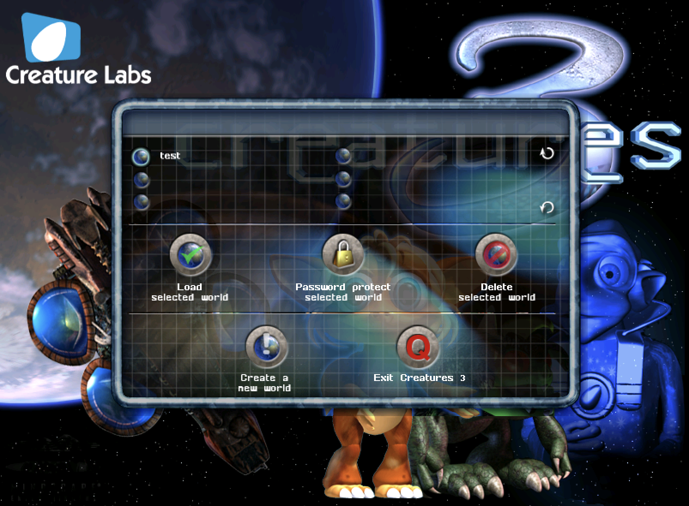
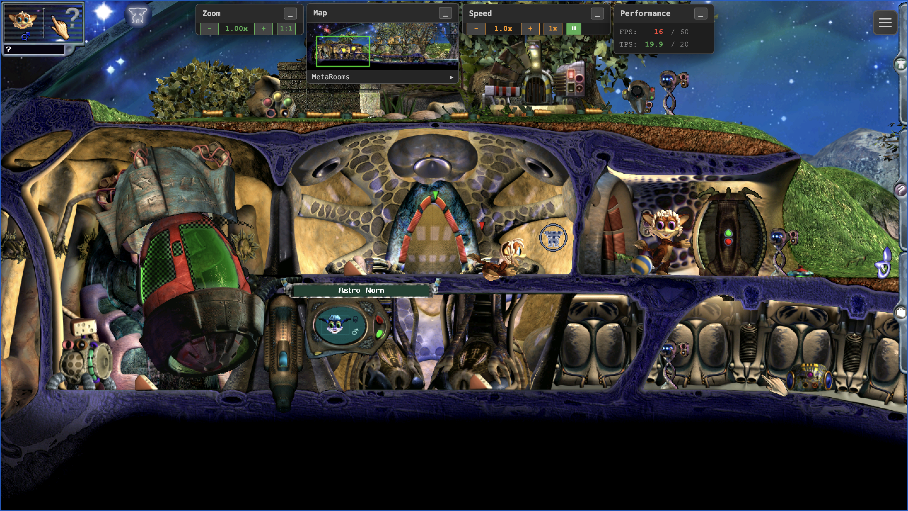
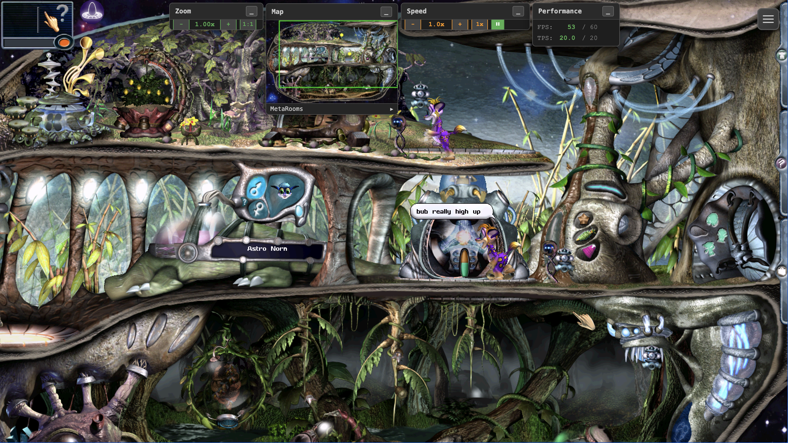
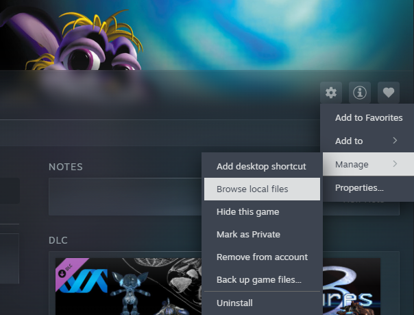

# Creatures Web Rebuild

A modern, browser-based rebuild of the classic artificial-life game **Creatures 3** (1999)
and its companion **Docking Station**, originally by Cyberlife / Creature Labs.

Creatures is a "digital biology" simulation: you hatch, raise, teach, and breed **Norns** —
little creatures with real simulated biochemistry, neural-network brains, and digital
genetics (DNA) that mutates and is passed on to their offspring. Care for them, teach them
language, keep them healthy, and grow a living, evolving world that runs entirely in your
browser.

This project faithfully recreates the original engine using modern web technologies. Play it
straight in your browser at **[creatures.world](https://creatures.world)**, or run it locally
with the desktop launcher — either way there's no account, no telemetry, and nothing is
uploaded: your assets and save games stay on your own machine.

> ⚠️ **You must own the original game assets.** Neither the website nor this download contains
> any copyrighted art, sounds, or creature data — only the rebuilt engine. See **Asset Packs**
> below.

---

## Screenshots

🎬 <strong><a href="https://youtu.be/i_-hINH7pLU" target="_blank" rel="noopener">Presentation of the project</a></strong> (YouTube)

### Launcher


### Creatures 3


### Docking Station


---

## New Features

The rebuild stays faithful to the original game, but running in a modern browser makes room
for a few things the 1999 engine never had:

- **Zoom** — zoom in and out of the world freely, from close-up detail to a wide view of the
  surroundings.
- **Speed management** — control the game's execution speed: slow things down to watch a
  moment unfold, or speed the simulation up to fast-forward through the quiet stretches.
- **Mini-map** — an overview of the current metaroom that shows where you are and lets you
  jump anywhere with a click.
- **Touch-screen support** — full touch controls for tablets and phones, including gesture
  mapping for mouse actions and a virtual keyboard (see **Note on Tablets** below).
- **Full debugger** — deep-dive into the game's mechanics as they run: inspect the world, the
  ecosystem, and every creature's biochemistry, brain, and genetics in real time (see
  **The Debugger** below).
- **Wiki** — built-in documentation covering all the mechanics of the game.
- **Script documentation** — a browsable reference documenting all the COS scripts of
  Creatures 3 and Docking Station.

---

## The Debugger

The built-in debugger opens right on top of the running game and gives you a live view into
every layer of the simulation:

- **CAOS debugger** — visualize and debug all the CAOS scripts as they execute: step through
  them line by line, set breakpoints, and inspect the virtual machine's state.
- **Agent debugger** — browse every agent in the world and inspect its properties, scripts,
  and sprites.
- **Creatures debugger** — open up a creature and watch its biochemistry, organs, and brain
  in detail — lobes, neurons, chemical reactions, all live.
- **Map debugger** — visualize the metarooms, rooms, CA (cellular automata) levels, and all
  their characteristics.
- **Performance profiler** — see where the engine spends its time and track the simulation's
  performance.
- **Graphing tool** — trace values over time: chemical concentrations inside creatures,
  ecosystem variables, and game-mechanics variables, all plotted live.

---

## How to Install

### Which option should I choose?

| | **Option 1 — Browser (creatures.world)** | **Option 2 — Desktop Launcher** |
| --- | --- | --- |
| Setup | Nothing to install — open the site and play | Install Node.js, unzip, `npm install` |
| Where your data lives | In the **web browser's storage** on that device | As **regular files on your computer's disk** |
| Durability | Can be **wiped if you clear the browser's site data** (backups available, see below) | Permanent — survives browser cleanups, easy to back up like any folder |
| Network play | Each device keeps its own independent copy | **Share over your network**: assets, save games and settings live on one machine; tablets/phones connect via the Launcher's External URL |

**Option 1** is the quicker and more convenient way to play — but remember that everything
(imported assets, worlds, creatures, settings) lives inside the browser: clearing site data
for creatures.world deletes it all, and there is **no direct way to share a save file between
multiple devices on your network** — each device has its own separate storage (moving a world
means downloading it on one device and uploading it on the other via the Maintenance
section). The Launcher's **Maintenance** section also lets you download your save games and
settings as backup zips (and restore them later), so back up anything you care about.

**Option 2** stores your save games and settings permanently as ordinary files on the
computer where it's installed, and adds network flexibility: the assets, saves and settings
are hosted from that one machine, and any device on your network (tablet, phone, laptop) can
play the same worlds through the Launcher's **External URL**.

### Option 1 — Play in your browser (recommended, nothing to install)

Just point your browser to:

> ### 👉 **https://creatures.world**

That's it. The first visit opens the **Launcher** page, where you import your own copy of the
game assets (see **Adding your assets** below) — after that, click an asset pack and play.

- Everything — imported assets, worlds, creatures, settings — is stored **in your browser's
  local storage**, on your device. Nothing is uploaded anywhere.
- Because storage belongs to the browser: don't "clear site data" for creatures.world without
  exporting your worlds first (the Launcher's **Maintenance** section has backup buttons), and
  note that a different browser or device starts fresh.
- Works on Windows, macOS, Linux, and tablets — any modern browser. **Chrome is the
  preferred browser**: it's what the game is developed and tested on, and it has the most
  robust support for the in-browser storage the game relies on. Other Chromium browsers
  (Edge, Brave, Opera) are equally good; Firefox and recent Safari work but see less
  testing.

### Option 2 — Run locally with the desktop Launcher

Prefer a fully self-hosted setup, or want to serve the game to tablets on your own network?
Install the desktop package:

### Requirements

- **[Node.js](https://nodejs.org/) 18 or newer** — the only thing you need to install.
  (The launcher is built on Electron, which is downloaded automatically on first run.)
- ~300 MB of free disk space (most of it the Electron runtime fetched on first install).
- An internet connection for the **first** install only — it runs offline afterwards.

### Steps

1. **Download** the latest `creatures-js-v<version>.zip` from the
   [**Releases**](../../releases) page.
2. **Unzip** it to a folder you can write to (e.g. your Documents or Desktop).
3. Open a terminal in that folder and run:

   ```bash
   npm install     # first run downloads the Electron runtime for your OS (~100–200 MB)
   npm start       # opens the Launcher
   ```

4. In the **Launcher**:
   - **Setup tab** — confirm Node.js is detected, point it at your **assets directory** (or
     use **Import…** to copy a game installation in), and click **Generate Index** for each
     asset pack.
   - **Run tab** — click **Start Server**, then **Open in Browser**.

Works on **Windows, macOS, and Linux** from the same download.

### Playing from another device (tablet, phone, laptop)

By default the Launcher's server is reachable **only from the computer it runs on** — local
network access is **off**, so no other device can connect. This keeps things safe out of the
box. To play on another device on your home network (for example a tablet), turn it on:

1. **Run tab → Server** — tick **Allow other devices on my local network to connect**.
2. **Restart the server** (**Stop Server**, then **Start Server**) so the change takes effect.
3. The **External URL** shown on the Run tab becomes active — open that address in the other
   device's browser. (While network access is off, that URL reads *Disabled (localhost only)*.)

> ⚠️ **Network-security warning.** Enabling this exposes the game server to **every device on
> the same network**, and the server has **no password or authentication of any kind**. Only
> turn it on when you are on a network you own and trust — your own home Wi-Fi, **not** a public,
> shared, café, hotel, workplace, or guest network. Before switching it on, make sure your
> router/Wi-Fi is properly secured (a strong password and WPA2/WPA3 encryption), and turn the
> option back off when you no longer need to serve the game to other devices.

> ⚖️ **Copyright reminder.** The game's assets are copyrighted material. Making the server
> reachable over the **public internet** — giving access to people who have **not purchased**
> the game and its assets — is a **violation of copyright**. Network access is intended solely
> for **your own personal use** of a **legitimately purchased copy** of the assets, on devices
> you own within your private network.

### Updating

The Launcher checks for new releases automatically and shows an **Update available** notice on
the Run tab. Click **Update now** and it downloads and installs the new version in place,
**keeping your assets, settings, and configuration**.

If the automatic update ever fails, see **"The automatic update failed — how do I update
manually?"** in the **FAQ** below.

---

## Asset Packs

The game needs the original **copyrighted** assets (sprites, sounds, genetics), which are
**not** included here — you must own them. Two asset packs are supported:

| Asset Pack | Get it on Steam |
| --- | --- |
| **Creatures 3** | https://store.steampowered.com/app/1797350/Creatures_Docking_Station__Creatures_3/ |
| **Docking Station** | https://store.steampowered.com/app/1659050/Creatures_Docking_Station/ |

> Buy Creatures 3 to support the game, it's worth it — come on, it's less than a fancy coffee! ☕

### Adding your assets

#### On creatures.world (browser)

The Launcher page's **Asset packs** section has three import buttons — use whichever fits how
you have the game:

1. **Import pack (.zip)…** — pick a zip of your game folder. Make the zip yourself: go to your
   Steam install (see **Where Steam installs the game** below), zip the **`Creatures 3`** or
   **`Docking Station`** folder (right-click → *Compress* / *Send to → Compressed folder*), then
   select that zip.
2. **Import folder…** — skip the zipping and pick the game folder (e.g. `Docking Station`)
   directly. Easiest when playing on the same machine the game is installed on.
3. **Import from URL** — paste a direct link to a pack zip you host yourself (a NAS, a private
   cloud link). The hosting server must allow cross-origin downloads (CORS).

A progress bar tracks the import (a couple hundred MB, typically well under a minute), the pack
index is generated automatically if needed, and the pack appears as a tile marked
**Index ready** — click the tile to play. Import one or both packs; Docking Station builds on
Creatures 3, so installing both gives the fullest experience.

> 💾 The page will ask the browser for **persistent storage** so your packs and saves survive;
> the storage meter under the buttons shows how much space is used.

**Playing on a tablet too?** Import once on your desktop, then click **⬇** on the pack tile to
export the pack as a zip (it includes your worlds and settings), transfer the file to the
tablet (AirDrop, cloud drive, USB…), and import it there at creatures.world. Each device keeps
its own independent copy in its browser storage.

#### With the desktop Launcher

- Put your purchased game folder(s) — named exactly **`Creatures 3`** and/or
  **`Docking Station`** — inside the `Assets/` directory of the unzipped package, **or** point
  the Launcher at another location via **Setup → Assets → Browse…**.
- The Launcher can also **Import…** a game installation for you, then **Generate Index** to
  make each pack playable.

#### Where Steam installs the game

The Steam edition installs **both games into a single folder named `Creatures Docking Station`**
inside your Steam library's `steamapps/common`. The default locations are:

| OS | Typical default path |
| --- | --- |
| **Windows** | `C:\Program Files (x86)\Steam\steamapps\common\Creatures Docking Station\` |
| **macOS** | `~/Library/Application Support/Steam/steamapps/common/Creatures Docking Station/` |
| **Linux** | `~/.steam/steam/steamapps/common/Creatures Docking Station/` (or `~/.local/share/Steam/steamapps/common/…`) |

If you installed Steam (or this game) on another drive/library, the path differs. The reliable
way to find it: in Steam, open the game's page in your Library and click the **gear icon (⚙)** on
the right — then **Manage → Browse local files**. (Right-clicking the game in the Library list
gives you the same menu.) That opens the exact folder, whatever the path:



The folder that opens is the **`Creatures Docking Station`** folder itself — the one containing
the `Creatures 3` and `Docking Station` subfolders you need to import.

> The game is a native **Windows** title. On **Linux** it runs through Proton, but the asset
> files still live at the `steamapps/common/Creatures Docking Station/` path above. There is no
> native **macOS** build, so Mac users typically copy the assets from a Windows/Linux install
> (the assets themselves are platform-independent data).

## The Launcher page (creatures.world)

On creatures.world, the Launcher is the page you land on before the game starts. Besides the
asset-pack tiles it has three collapsible sections:

### Configuration

Click **Configuration** to expand it. The options:

| Option | What it does |
| --- | --- |
| **Default pack** | Pick a pack to skip the Launcher entirely — the game then boots straight into that pack on every visit. Leave on *(ask every time)* to land on the Launcher. |
| **Debug mode** | Enables the developer overlays (F3) and verbose logging — the same debug tooling described in **The Debugger** above. Off for normal play. |
| **Share anonymous usage statistics** | On by default. Sends anonymous player counts and page views to Google Analytics so we know how many people play. Untick to opt out — nothing is sent at all. Details in **Privacy & anonymous usage statistics** below. |
| **NornAI companion** | Enables the experimental LLM-driven creature variant. Requires a remote endpoint (below); leave off otherwise. |
| **NornAI remote endpoint** | Address of a server providing the NornAI service (`https://…`). Empty = NornAI unavailable, which is the normal state for the hosted game. |
| **Advanced overrides (JSON)** | Free-form engine settings merged into the game's configuration — the keys are documented in the in-game wiki article **"Configuration Options (GlobalConfig)"**. For experts; leave empty otherwise. |

Click **Save configuration** to apply. Settings are stored in your browser (per device) and
most take effect immediately; a few need a page reload.

### Maintenance

Backup tools for everything you'd hate to lose: **Export worlds & creatures** downloads a zip
of all your saves, **Restore backup** puts one back, and the **World saves** list lets you
download or upload individual worlds per pack (newest first, with their last-played date).
Back up before clearing browser data — clearing site data for creatures.world deletes your
packs *and* saves.

### How to get back to the Launcher

If you've set a **Default pack**, the game boots directly and skips the Launcher. Two ways
back:

- **In the game**: open the burger menu (☰) and click **🚀 Launcher** in the **World** section
  (you'll be asked to confirm — save your world first, leaving the game discards unsaved
  progress).
- **By URL**: open **https://creatures.world/?launcher=1** — worth bookmarking. This always
  shows the Launcher, whatever the configuration.

The Launcher also reappears on its own whenever no valid asset pack is available.

---

### Your settings — the `Rebuild` folder

*(Desktop Launcher installs only — on creatures.world the equivalent settings live in your
browser's storage and are included in the Maintenance backups.)*

The game automatically creates a **`Rebuild/`** folder inside each asset pack's directory
(e.g. `Assets/Docking Station/Rebuild/`). This folder holds your personal settings for that
pack, saved as plain JSON files:

| File | What it stores |
| --- | --- |
| `ui-settings.json` | General UI preferences — floating menu state, popout window positions, volume, UI spacers |
| `graph-layout.json` | Your Graph tab setup — graph tabs, selected metrics, creature bindings, time window, and averaging window |
| `console-settings.json` | Debug Console preferences — per-module log levels, category filters, collapsed-group state |

These files are created and managed by the game itself — you never need to edit them, and the
original engine never touches them. Each asset pack keeps its own `Rebuild/` folder, so your
Creatures 3 and Docking Station settings are independent.

> 💾 **Back up this folder!** If you reinstall, move, or re-import your assets, copy the
> `Rebuild/` folder somewhere safe first and restore it afterwards — otherwise your UI layout,
> graph configurations, and console preferences will be reset to defaults.

---

## Advanced configuration

> ⚠️ **For advanced users.** Normal play never needs this — the Launcher's **Configuration**
> section covers the common options. Only read on if you want to tune the engine itself.

Beyond the Launcher options, the engine reads an optional configuration file named
**`config.dev.js`** at game start. It can override any engine setting — physics, rendering,
CAOS execution, debugging, NornAI, and more. Every available key is documented in the in-game
wiki article **"Configuration Options (GlobalConfig)"** (burger menu ☰ → **Help** →
**Web Rebuild** section).

### How the file works

The file is created from a shipped template in which **every setting is commented out**,
shown at its engine default. To override a setting, uncomment its line and change the value:

```js
engine: {
    // tickRate: 20,        // ← commented: the engine default applies (also after updates)
    timeScale: 2.0,         // ← uncommented: your override wins
},
```

- Anything left commented keeps following the **engine defaults, including after game
  updates** — so only uncomment what you actually want to pin.
- If you uncomment a **list** (an `[...]` value), your copy replaces the built-in list
  entirely and won't pick up entries added by future updates — prefer leaving lists commented
  unless you need to change them.
- URL parameters (e.g. `?physics=false`) still override the file for one session.

### Where to edit it

| Where you play | How to edit |
| --- | --- |
| **creatures.world (browser)** | Launcher page → **Configuration** → **📝 Edit config.dev.js…** (edits are validated before saving; **⬇ Download** / **⬆ Upload** let you move the file between devices). |
| **Desktop Launcher** | **Setup** tab → **Config file** card → **Open** — the file (`Main_Game/config.dev.js` in the install folder) opens in your text editor. Restart the game page to apply changes. |

### Restoring the defaults

If your configuration ever gets into a bad state — or you just want a clean slate — restore
the file from the template to get back the default initial configuration:

- **creatures.world**: Launcher page → **Configuration** → **↺ Reset from template**.
- **Desktop Launcher**: **Setup** tab → **Config file** card → **Restore from template**
  (your previous file is kept next to it as `config.dev.js.bak`).

Since the template ships with everything commented out, a restored configuration simply
follows the engine defaults again.

---

## Privacy & anonymous usage statistics

The game reports **anonymous usage statistics** through Google Analytics so we can see how many
people actually play: page views, a "game started" event with the asset pack used, and the
coarse geography Google derives. No account, no personal data, no gameplay content — your
worlds, creatures, and settings never leave your machine.

**Statistics are ON by default.** Any ONE of these switches them off:

| Where you play | How to opt out |
| --- | --- |
| **creatures.world (browser)** | Launcher page → **Configuration** → untick **Share anonymous usage statistics** → **Save configuration**. Applies immediately, stored per browser. |
| **Desktop Launcher** | **Setup** tab → **Privacy** card → untick **Share anonymous usage statistics**, then restart the server. Covers everyone who plays through that server. |
| **Any game URL** | Add `?analytics=false` to the address (e.g. `…/?analytics=false`). |

The game also honors your browser's **Global Privacy Control** signal automatically, and if you
use an ad-blocker it most likely blocks Google Analytics on its own — the game runs exactly the
same either way.

---

## Note on Tablets (iOS, Android)

Touch devices have no mouse, so the game maps finger gestures to mouse actions. Open the game
in your tablet's browser via the Launcher's **External URL** — with the desktop Launcher this
first requires enabling **local network access** (off by default; see **Playing from another
device** and its security warning under *How to Install → Option 2*). Then use:

| Gesture | Action |
| --- | --- |
| Swipe with **one finger** | Move the mouse cursor |
| Tap with **one finger** | Left click |
| Swipe with **two fingers** | Scroll the view (move the camera) |
| Tap with **two fingers** | Right click |

---

## Known problems

These are known problems but it's not clear if they are specific to the rebuild engine or they
already existed in the original implementation of the game.

- In Docking Station, after some time, the creatures are wandering and getting stuck at the top
  level, apparently they are attracted by a food smell and enter in a locking state. The analysis is stating: Your norns can still park next to a correct food gradient whose only ascent is a lift link, receive GO_RIGHT → stimulus 54 → nothing, and starve. Every part of that is faithful to the original, so fixing it is a deliberate divergence. A solution is to diverge from the original and make WhichDirectionToFollowCA classify a cross-floor link as GO_UP/GO_DOWN instead of by the |dx| vs |dy| ratio.
- When creatures are spawned in Docking Station from the standard genome, they twitch and
  shiver. They are not doing this in the original game, but all investigations are pointing
  toward a legitimate behavior or reaction due to a cold environment. More investigation is
  needed.

---

## Troubleshooting

### The game runs slowly / the frame rate is poor

**Check your browser's hardware acceleration first.** The game draws the whole world through
an HTML canvas, and browsers only render that on the graphics card when hardware acceleration
is enabled. It is *supposed* to be on by default in every modern browser — but it is routinely
switched off without you noticing: a driver blocklist entry, an old or generic graphics driver,
a power-saving profile, running in a virtual machine or a remote-desktop session, or simply a
setting somebody turned off long ago. When it falls back to software rendering the game still
works perfectly, just far slower.

#### Google Chrome (and Edge, Brave, Opera, Vivaldi)

**1. Check whether it is actually on.** Type this in the address bar:

```
chrome://gpu
```

At the top, under **Graphics Feature Status**, look at the **Canvas** and **Compositing**
lines. You want them to read **Hardware accelerated**. If they say *Software only, hardware
acceleration unavailable*, that is your performance problem.

**2. Turn it on.** Open:

```
chrome://settings/system
```

Enable **Use graphics acceleration when available**, then **restart the browser** (fully quit
and reopen it — a page reload is not enough). Go back to `chrome://gpu` to confirm the lines
now read *Hardware accelerated*.

> On the other Chromium browsers the same pages exist under their own prefix — `edge://gpu`
> and `edge://settings/system`, `brave://gpu` and `brave://settings/system`, and so on.

If it still reports software rendering after restarting, your GPU or its driver is on the
browser's blocklist — the fix is to **update your graphics drivers** (and your OS), then
restart and check again.

#### Mozilla Firefox

**1. Check whether it is actually on.** Type this in the address bar:

```
about:support
```

Scroll to the **Graphics** section and look at **Compositing**:

| Value | Meaning |
| --- | --- |
| `WebRender` | ✅ Hardware acceleration is active. |
| `WebRender (Software)` | ⚠️ Software rendering — this is what makes the game slow. |
| `Basic` | ⚠️ Software rendering (older fallback path). |

Further down the same section, the **Decision Log** explains *why* something was disabled
(usually a blocklisted graphics driver) — useful when reporting a problem.

**2. Turn it on.** Open **Settings** (☰ menu → Settings) → **General**, scroll to
**Performance**, and:

1. Untick **Use recommended performance settings** (this reveals the hidden options).
2. Tick **Use hardware acceleration when available**.
3. **Restart Firefox**, then re-check `about:support` → Graphics → Compositing.

**3. If it is still software.** Advanced users can force it: open `about:config`, accept the
warning, and set:

| Preference | Value |
| --- | --- |
| `gfx.webrender.all` | `true` |
| `layers.acceleration.disabled` | `false` |
| `gfx.canvas.accelerated` | `true` |

Restart Firefox afterwards. If Firefox overrides these back to software, the cause is again a
driver blocklist entry — **update your graphics drivers** and try once more.

#### Other things to check

- **Use Chrome if you can.** The game is developed and tested on Chrome, and it is the fastest
  and most reliable option. Firefox and Safari work, but see far less testing.
- **Close the debug console and overlays** while playing. The debugger, the live graphs, and
  the F3 debug overlays all cost frames — they are development tools, not gameplay features.
  Also leave **Debug mode** off in the Launcher's **Configuration** section for normal play.
- **Zoom out less.** A wide zoomed-out view means far more of the world to draw each frame.
- **Close other heavy tabs and applications** — the browser shares your GPU with everything else.
- **On a laptop, plug it in.** Battery-saver modes throttle the GPU aggressively, and some
  systems switch the browser to the slower integrated graphics chip when unplugged.
- **On tablets and phones**, expect lower performance than on a desktop — this is normal.

If performance is still poor after all of this, open an issue on
[GitHub](../../issues) and include the contents of your `chrome://gpu` or `about:support`
Graphics section, along with your OS and device.

### The game behaves strangely — reset your configuration to the defaults

If the game starts misbehaving in ways that look wrong rather than merely slow — creatures or
objects not moving or falling, the simulation running far too fast or too slow, scripts not
firing, features missing or acting oddly — the most likely cause is a **leftover setting in
your engine configuration**, not a bug. The engine reads an optional `config.dev.js` file that
can override *any* internal setting (physics, rendering, CAOS execution, timing, and more), and
a single option left switched on from an earlier experiment is enough to make the game look
broken.

**Before reporting a bug, revert your configuration to the defaults.** The template ships with
every setting commented out, so a restored file simply follows the engine defaults again —
your **assets, worlds, creatures and save games are not touched** by this.

#### On creatures.world (the browser Launcher)

1. Go to the Launcher page — from inside the game, burger menu (☰) → **🚀 Launcher**, or open
   **https://creatures.world/?launcher=1** directly.
2. Expand the **Configuration** section.
3. Click **↺ Reset from template**, and confirm.
4. While you are there, also clear anything you had set by hand in that same section: empty the
   **Advanced overrides (JSON)** box, untick **Debug mode**, then click
   **Save configuration**. These are stored separately from `config.dev.js` and override it.
5. Reload the game page.

> 💡 Want to keep a copy of your current file first? Click **⬇ Download config.dev.js** before
> resetting — you can put it back later with **⬆ Upload config.dev.js…**.

#### With the desktop Launcher (Electron)

1. Open the Launcher and go to the **Setup** tab.
2. Find the **Config file** card (it shows the status of `config.dev.js`).
3. Click **Restore from template**, and confirm.
   Your previous file is **kept next to it as `config.dev.js.bak`**, in case you want anything
   back from it.
4. Restart the server (**Run** tab → **Stop Server**, then **Start Server**) and reload the
   game page.

#### Also check the address bar

Engine settings can be overridden **for a single session** by URL parameters — for example
`?physics=false` or `?debug=true`. If you are opening the game from a bookmark or a link you
saved while testing something, those parameters come back every time and silently override both
the Launcher settings and `config.dev.js`. Open the plain address
(**https://creatures.world**, or the Launcher's own **Open in Browser** button) and re-bookmark
that instead.

If the odd behaviour survives a full configuration reset, then it is worth reporting — please
open an issue on [GitHub](../../issues) with a description and, ideally, a save file.

---

## FAQ

**Does the game work on Windows, Mac, Linux, iPad, and Android?**

Yes — the game is full JavaScript, meaning it is compatible with any device that can run a
modern browser. **Chrome (or another Chromium browser like Edge) is preferred** — it's the
best-tested; Firefox and Safari work too. The simplest way is to open
**https://creatures.world** directly on the device. (With the desktop Launcher instead, the
game is served from a Windows/macOS/Linux computer and tablets/phones connect over your local
network using the **External URL** the Launcher shows — which requires turning on **local
network access** first; it is off by default. See **Playing from another device** under
*How to Install → Option 2*.)

**Does the game work on touchscreens?**

Yes! The engine automatically detects that your device supports touch inputs. You can use a
one-finger tap to left click, a two-finger tap to right click, a one-finger swipe to move the
cursor, and a two-finger swipe to move the camera. A new button will show next to the burger
menu to open the virtual keyboard for text input.

**Can the game support multiple screens?**

Yes. Extend your display (rather than mirroring it), then stretch the Chrome window holding the
game across all the screens you want to use. Open the **burger menu (☰) → Config** and define a
space on the **left**, **right**, **top**, or **bottom** side of the play area, in pixels. That
space is left blank and the play area shrinks to fit beside it — giving you somewhere to move
your floating windows (minimap, performance, debug console, Ask Claude) without hiding any of
the game.

**What keyboard shortcuts are available?**

- **Arrow keys** — scroll the camera (screen-edge scrolling, the mouse wheel, and middle-drag
  work too, like the original game).
- **Ctrl+`** (the backtick key) — open/close the **debug console**: logs, the CAOS debugger,
  and engine inspectors. **F12** does the same, but in a browser it usually opens the
  browser's own developer tools instead, so prefer **Ctrl+`**.
- **F3** — toggle the **debug overlays** (performance stats, room boundaries, agent bounds).
- In debug worlds (the engine's debug keys enabled): **Pause** pauses/resumes the game and
  **Space** advances a single tick while paused — mirroring the original engine.

**Where can I get documentation?**

The game ships with a full **wiki** packed with gameplay articles — creature biology, brain and
genetics deep-dives, game systems, tools, and Web Rebuild specifics. Open it from inside the
game: click the **burger menu** (☰) and select **Help**. The wiki opens in a new tab with a
browsable table of contents and full-text search.

**How to configure the engine options?**

Please consult the in-game wiki article **"Configuration Options (GlobalConfig)"** — it is a
complete reference for every engine setting, what it does, its default value, and how to change
it. (Open the wiki via the **burger menu (☰) → Help**, then find the article in the
**Web Rebuild** section.)

**I found a zip online with the assets — can I use it?**

Please, **no**. The game assets are copyrighted material — buy the game on Steam.

**The automatic update failed — how do I update manually?**

Rarely, the desktop Launcher's in-place update can fail (aggressive antivirus, a network
hiccup, locked files) — the Launcher restarts on the previous version, shows a warning in the
update card, or doesn't start at all. A manual update always works:

1. **Close the Launcher** — and any terminal window open inside the install folder.
2. **Rename** your current install folder, e.g. `creatures-js` → `creatures-js-old`.
3. **Download** the latest `creatures-js-v*.zip` from the [Releases page](../../releases) and
   unzip it where the old folder was.
4. **Carry over your data** from the old folder into the new one:
   - the contents of the `Assets` folder (your imported asset packs, worlds, and settings);
   - `Main_Game/config.dev.js`, if present (your engine configuration).
5. In the new folder, run `npm install`, then `npm start`.
6. Once everything works, delete the old folder.

**Special case:** if the Launcher won't start right after an automatic update with an error
like `'electron' is not recognized as an internal or external command`, the update itself
applied but its dependencies didn't finish installing — no need for the full manual update.
Just open a terminal in the install folder, run `npm install`, then `npm start`.

When reporting an update problem, include the updater log:
`%APPDATA%\creatures3-web\logs\c3-update.log` on Windows,
`~/Library/Logs/creatures3-web/c3-update.log` on macOS.

**How can I report a bug?**

Open an issue on [GitHub](../../issues). Include a detailed description of the problem and the
context (what you were doing, which asset pack, your browser/OS), and — ideally — share a save
file so we can reproduce it. The version string shown in the in-game floating menu and the
asset-pack picker is helpful to include too.

---

## Where to get support?

Join the **Creatures World** Discord server — it's the place to ask questions, get help with
setup, share your worlds and Norns, and follow the project's development:

👉 **https://discord.gg/4zUg9VvYaG**

To report a bug, please use the [GitHub issues](../../issues) function (see **FAQ** above for
what to include).

---

## Licence

This software is **proprietary and free of charge**. By playing at creatures.world, or by
installing and using the desktop Launcher, **you agree to the
[End User Licence Agreement](LICENSE.txt)** — please read it.

In short: you may use it for your own personal, non-commercial play, on any device you own,
and serve it across your own private network. You may not redistribute it, sell it, host it
on the public internet, or reverse-engineer it. It contains **no game assets** — you must own
a lawful copy of Creatures 3 / Docking Station (see **Asset Packs** above).

Third-party components and their licences are listed in
[THIRD-PARTY-NOTICES.txt](THIRD-PARTY-NOTICES.txt).

## Notes

- This is a **run-only** build: the game engine ships as a bundled, minified package — there is
  no source code or developer tooling in this download.
- Not affiliated with or endorsed by Cyberlife, Creature Labs, Gameware, or the current
  rights holders. "Creatures", "Docking Station", and related names are trademarks of their
  respective owners. Game assets remain the property of their owners and are not distributed
  with this project.